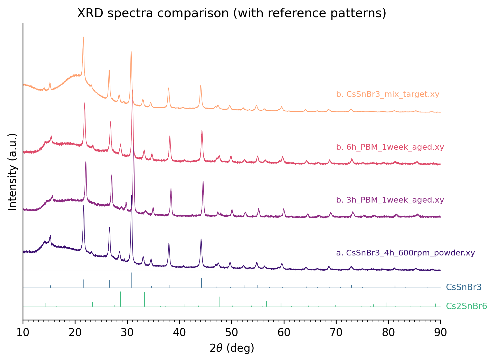

# XRD Data Comparison
# Automated, fast and simple

## Overview

This repository contains a Python-based standalone executable for comparing multiple powder X-ray Diffraction (XRD) data. The program focuses on easy and fast visualization of the experimental data.

For questions, feature requests, bug reports, or collaboration opportunities, please contact the [**developer**](https://github.com/JosueHernandez0000). If you found this tool helpful, you can show your support by: [**Buying me a coffee!**](https://buymeacoffee.com/josue.hernandez) Every coffee helps me stay awake to keep improving the tool, adding new features, and providing you with even better analysis capabilities.

### Table of Contents
1. [Overview](#overview)
2. [Functionality](#functionality)
3. [Main Outputs](#Outputs)
4. [How to Use](#how-to-use)
5. [Technical Details](#technical-details)
6. [License](#license)


---
## 2. Functionality
1. **Plots multiple XRD data in the same plot**: Plots experimental data, all files must be in .xy format and stored in the same folder `xy_data`.


## 3. Main Outputs
The code is meant to be a quick and easy way to plot and visualize experimental XRD data. The main output of the program is:

<div align="center">
   
</div>


## 4. How to Use
Follow these steps to use the software:
1. **Clone the repository to your own machine**
2. **Make sure the following folder structure is followed**:
```
XRD Compare 1.0.1/
├── reference_patterns/  
│   └── reference_patterns.xlsx   # Stores the crystallographic information of the reference patterns             
│
├── plots/                        # Stores the generated plots
|
├── xy_data/
│   └── your_data.xy       # XRD data to be analyzed
|
├── README.txt             # Documentation for the project.
├── LICENSE     
└── XRD_compare.exe      # Standalone .exe file
```

3. **Run the .exe file**
4. **Select all the files you want to compare**
4. **Open the plots in the plots folder**


## 5. Technical Details

### Adding more reference patterns
- The crystallographic information (peak position, peak intensity and miller indices) of the current reference patterns is stored in `reference_patterns.xlsx`. Information was obtained from the Crystallographic Open Database.
- This project does not uses the miller indices, so you could potentially omit this information when adding more reference patterns
- You can add more reference patterns by simply:
   - Create a new sheet in the Excel file
   - Rename the sheet to match the name of your reference patterns
   - Fill in the Excel sheet with the crystallographic information (please follow the same structure and column names as in the current file). 
- Not following these instructions to add a new reference pattern will crash the program.

## 6. License

This project is licensed under the MIT License — see the `LICENSE` file for details.

